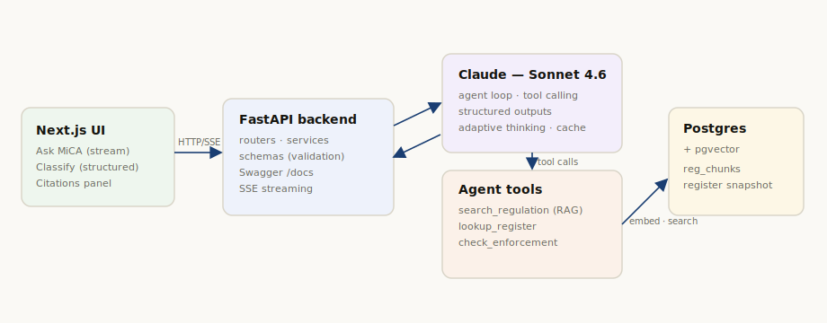

# MiCA Compliance Copilot

A small but complete **GenAI application**: a Retrieval-Augmented + agentic assistant for
the EU **Markets in Crypto-Assets Regulation** (Regulation (EU) 2023/1114, "MiCA").

It answers regulatory questions **grounded in the actual regulation text with
article-level citations**, **classifies a token or service under MiCA** as a structured
result, and can **look up the ESMA register snapshot** through tool-calling — refusing to
answer when the indexed corpus doesn't support a grounded answer.

> Built for the AUEB *AI for Developers — Building with LLMs* final project. Architecture:
> **FastAPI backend + Next.js UI + Claude (RAG · agents · tool-calling · structured outputs · prompt caching)**.



---

## 1. Description

| | |
|---|---|
| **Problem** | MiCA is long and dense; a general chatbot hallucinates rules and can't cite them. Hallucination is unacceptable in a compliance setting. |
| **Solution** | A copilot whose answers are *retrieved* from an indexed MiCA corpus and *cited by article*, with an agent that also queries real ESMA register data. |
| **AI is central** | Without RAG + the agent's tools the app cannot function — it is not a wrapper around a single prompt. |
| **Users** | Compliance/legal teams, crypto founders, students of EU financial regulation. |

**GenAI techniques used** (and why): **multi-source RAG** — answers are grounded in (a) an official
**document corpus** (the Regulation *plus* the Level-2/3 RTS/ITS and ESMA/EBA guidelines & Q&As) and
(b) a **full-text news corpus** (EU regulators + trade press), each cited; **tool / function calling**
(the agent routes between `search_regulation`, `search_news`, and the register lookups);
**structured outputs / JSON schema** (the `/classify` endpoint); **prompt caching**; and
**role-based system prompting** with an explicit *abstention* rule and "law vs. current-facts" routing.

---

## 2. Installation

**Prerequisites:** Docker (for Postgres + pgvector), Python 3.11+, Node 18+.
A Claude API key is needed for `/chat` and `/classify`. Embeddings run **locally and key-free**
by default (`EMBEDDER=local`, mxbai-embed-large-v1), so the whole pipeline is reproducible offline.

```bash
git clone <this-repo> mica-copilot && cd mica-copilot

# Python backend
python -m venv .venv && source .venv/bin/activate
pip install -r requirements.txt

# Config
cp .env.example .env
#  → set ANTHROPIC_API_KEY=...   (chat/classify)
#  → optionally set EMBEDDER=voyage + VOYAGE_API_KEY=... for the legal-tuned embedder

# Database (Postgres 16 + pgvector) — applies db/0001_init.sql on first boot
docker compose up -d

# 1) DOCUMENT corpus: regulation + RTS/ITS + ESMA/EBA guidelines/Q&As → reg_chunks
python -m app.rag.docs_ingest            # uses cached corpus; --refresh re-fetches from EUR-Lex/ESMA/EBA

# 2) NEWS corpus: full-text articles from EU regulators + trade press
python -m app.news.poll                  # one-shot; `python -m app.news.scheduler` keeps it fresh

# 3) ESMA REGISTERS: real CASP/issuer/white-paper data + read each white paper for its token
python -m app.register.sync --refresh    # fetch the public ESMA register CSVs (incl. ~877 Title II white papers)
python -m app.register.whitepapers       # read each white paper → token name/ticker (so "Cardano/ADA" match)
```

> **Shortcut:** every step above is a Make target —
> `make db && make docs && make news && make register` to build all three corpora, then
> `make api` (backend) and `make ui` (frontend). `make eval` runs the evaluation harness.

## 3. Run the backend

```bash
uvicorn app.main:app --reload --port 8000
```

- Swagger / OpenAPI docs: **http://localhost:8000/docs**
- Health / readiness: **http://localhost:8000/health**

## 4. Run the UI

```bash
cd frontend
npm install
npm run dev            # http://localhost:3000
```

The UI calls the backend at `http://localhost:8000` by default (override with
`NEXT_PUBLIC_API_URL`, see `frontend/.env.local.example`).

### Screenshots

| Ask MiCA — grounded answer + citations | Classify — structured result |
|---|---|
|  |  |

More in [`docs/DOCUMENTATION.md`](docs/DOCUMENTATION.md#screenshots) (incl. the landing page).

## 5. API endpoints

| Method | Path | Purpose |
|---|---|---|
| `POST` | `/chat` | Ask MiCA — **streamed** answer (Server-Sent Events): `tool`, `token`, `citations`, `done` events. |
| `POST` | `/chat/sync` | Ask MiCA — single JSON response (`answer`, `citations`, `tool_events`, `grounded`). |
| `POST` | `/classify` | Classify a token/service under MiCA — **structured JSON** (asset type, services a–j, obligations, citations). |
| `GET`  | `/registry/search?q=` | Search the **real ESMA registers** by firm OR token (CASPs / EMT-ART issuers / Title II white papers / warnings); returns the white-paper URL. |
| `GET`  | `/health` | Readiness: key configured, embedder, document chunks, news articles, register rows. |

The agent's tools: `search_regulation` (document corpus), `search_news` (full-text news), `lookup_register`, `check_enforcement`.

Example:

```bash
curl -s localhost:8000/chat/sync -H 'content-type: application/json' \
  -d '{"message":"What are the reserve requirements for an asset-referenced token?"}' | jq
```

## 6. GenAI logic

```
UI ──HTTP/SSE──▶ FastAPI ──▶ Claude agent loop ──▶ tools ──▶ Postgres/pgvector
                              (Sonnet 4.6, adaptive   ├─ search_regulation → reg_chunks (docs: L1+L2/3)
                               thinking, prompt cache) ├─ search_news       → news_chunks (full-text, dated)
                                                       ├─ lookup_register / check_enforcement
                                                       └─ routing: "law vs. current facts"
```

- **Two corpora:** `reg_chunks` holds the official **documents** (regulation + RTS/ITS + ESMA/EBA
  guidelines/Q&As); `news_chunks` holds **full-text news** (regulators + trade press), recency-ranked.
  Both are embedded locally (`mxbai-embed-large-v1`; or Voyage `voyage-law-2`) into pgvector.
- **Agent loop** (`app/services/llm.py`): Claude routes — "what does the law require" → `search_regulation`;
  "what's happening with X / deadlines" → `search_news` (+ register) — runs tools locally, feeds results
  back, answers **only** from retrieved sources (citing each, with dates for news), and abstains otherwise.
- **Structured classification** (`/classify`): RAG-grounded, then constrained to a JSON schema.
- **Prompt caching:** the stable system prompt carries `cache_control`; per-question context follows it.

See `docs/DOCUMENTATION.md` for the full architecture, data flow, prompt design, and
evaluation results.

## 7. Documentation

- **Full documentation:** [`docs/DOCUMENTATION.md`](docs/DOCUMENTATION.md) — architecture, data flow, prompt design, evaluation.
- **Usage examples:** [`docs/EXAMPLES.md`](docs/EXAMPLES.md) — copy-paste requests/responses for every endpoint, the SSE event stream, the UI flows, and the eval run.
- **Docs index:** [`docs/README.md`](docs/README.md)
- **Architecture diagram:** [`docs/architecture.svg`](docs/architecture.svg)
- **Evaluation harness:** `python -m eval.run --e2e --judge` (or `make eval`)
  — measured (v2 935-chunk corpus): retrieval 0.73 · citation 0.82 · abstention 1.00 · faithfulness 0.82 (13 goldens, Sonnet 4.6)
- **License:** [MIT](LICENSE).

---

### Project layout

```
app/        FastAPI backend — routers/ services/ schemas/ agents/ rag/ news/ register/ + config, db, main
frontend/   Next.js 15 UI (Ask MiCA + Classify), design system adapted from mica-dashboard
data/       document_sources.json (34 sources) · document_corpus.jsonl (doc cache) ·
            register_snapshot.json (real ESMA registers) · wp_tokens.json (white-paper → token reads)
db/         0001_init.sql (pgvector schema: reg_chunks + news_chunks; register tables are created by app/register/sync.py)
eval/       goldens.jsonl + run.py scoring harness → results/scorecard.json
docs/       DOCUMENTATION.md · EXAMPLES.md · README.md (index) · architecture.svg
```

> **Notes & limitations.** The **document corpus** is real full text of public EU sources (the
> Regulation + adopted RTS/ITS from EUR-Lex + ESMA/EBA guidelines & Q&As), rebuildable offline from
> the committed cache or via `docs_ingest --refresh`. The **news corpus** stores full article text
> for retrieval accuracy and always cites + links the source with its date; trade-press text is kept
> for private analysis, not redistribution (set `NEWS_STORE=summary` for a transformative-summary
> mode). The ESMA registers are the **real** public data (CASPs, EMT/ART issuers, ~877 Title II crypto-asset
> white papers, warnings), synced from ESMA's CSVs; each white paper's token name/ticker is read from
> the white-paper document itself (best-effort — some links are dead/unreadable). **General information
> about MiCA, not legal advice.**
