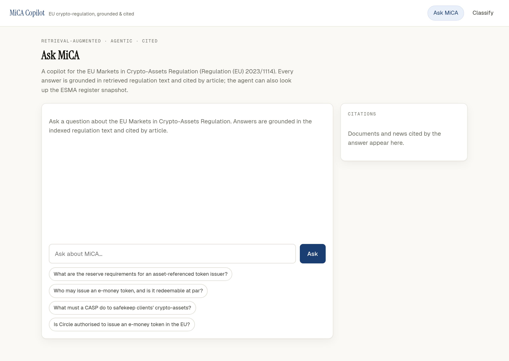
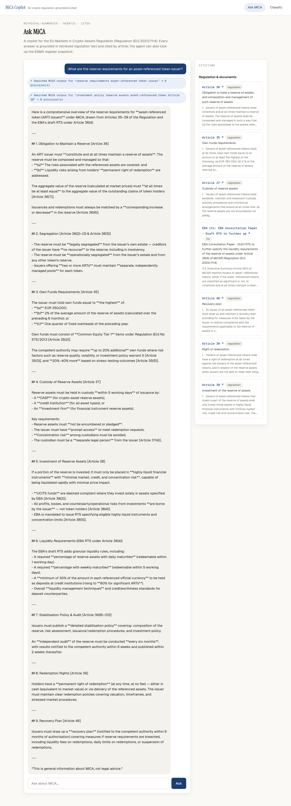
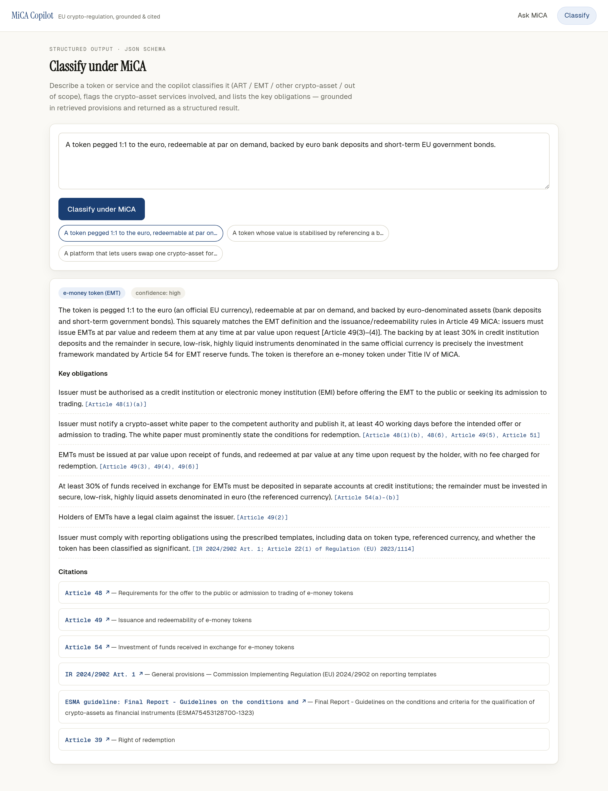

# MiCA Compliance Copilot — Documentation

**Course:** AI for Developers — Building with Large Language Models (AUEB).
**Type:** Generative-AI application — *not a chatbot*: AI logic embedded in a clean
software architecture (FastAPI backend + functional UI + GenAI layer).

---

## 1. Title, description, purpose

**MiCA Compliance Copilot** is a Retrieval-Augmented + agentic assistant for the EU
**Markets in Crypto-Assets Regulation** (Regulation (EU) 2023/1114, "MiCA").

**Purpose.** Answer MiCA questions *grounded in the actual regulation* with article-level
citations, classify a token/service under MiCA, and look up real ESMA register data — while
**refusing to answer** when the indexed corpus doesn't support a grounded answer. In a
compliance context, a confident-but-wrong answer is worse than "I don't know," so retrieval +
citation + abstention are the whole point.

## 2. Use scenario & functional requirements

**Scenario.** A compliance analyst or crypto founder asks, *"What backs the reserve of an
asset-referenced token?"* or *"Is my euro stablecoin an EMT, and what must I do?"* They need an
answer they can trust and trace back to a specific article — not a plausible paraphrase.

**Functional requirements**

- F1. Answer MiCA questions grounded in retrieved regulation text, with per-article citations.
- F2. Abstain (don't fabricate) when retrieval doesn't support an answer.
- F3. Classify a described token/service: asset type (ART / EMT / other / out-of-scope),
  the crypto-asset services (a–j) involved, and the resulting obligations — as structured data.
- F4. Look up whether a named entity is an authorised CASP / EMT issuer, or is flagged.
- F5. Stream answers and show the agent's tool-use trace; expose Swagger docs.

## 3. Technologies used & rationale

| Layer | Choice | Why |
|---|---|---|
| Backend | **FastAPI** | Async, typed (pydantic) request/response, automatic Swagger/OpenAPI — required by the brief and a clean orchestration point. |
| LLM | **Claude Sonnet 4.6** (agent loop, default) + **Haiku 4.5** (cheap tasks/judge) | Sonnet balances tool-use reasoning and cost; `AGENT_MODEL=claude-opus-4-8` is a one-line upgrade for maximum quality. Adaptive thinking + `effort`. |
| Vector store | **Postgres 16 + pgvector** | One self-contained DB (`docker compose up`) holds both the embeddings and the register snapshot; reproducible for a grader. |
| Embeddings | **mxbai-embed-large-v1** (local, default) / **Voyage `voyage-law-2`** | local model is 1024-dim, ~0.64 GB, runs **offline with no API key** (reproducible key-free); `voyage-law-2` is the legal-tuned paid alternative. |
| Sources | **EUR-Lex + ESMA/EBA** (docs) · **RSS** (news) · **ESMA register CSVs** (registers) | `feedparser` + `trafilatura` + `pypdf` ingest the regulation, RTS/ITS, guidelines/Q&As, full news articles, and the real ESMA registers (incl. Title II white papers, whose token is read from each document). |
| UI | **Next.js 15 / React 19** | Streaming chat + structured result rendering; design system adapted from the author's `mica-dashboard` (warm-paper + EU-blue, hand-rolled — no Tailwind). |

## 4. Architecture & data flow

```
┌────────────┐   HTTP / SSE   ┌──────────────────┐   tools    ┌───────────────────────────┐
│ Next.js UI │ ─────────────▶ │ FastAPI backend  │ ─────────▶ │ Agent tools               │
│ Ask · Class│ ◀───────────── │ routers/services │ ◀───────── │  search_regulation (docs) │
└────────────┘   tokens,      │ schemas, agents  │            │  search_news (full-text)  │
                 citations    └───────┬──────────┘            │  lookup_register / enforce│
                                      │ Claude (Sonnet 4.6)    └──────────┬────────────────┘
                                      ▼ adaptive thinking,                ▼
                              system prompt (cached)           Postgres + pgvector
                                                       reg_chunks (docs) · news_chunks · register
```

**Request flow for `/chat`:**
1. UI POSTs the question; backend opens a streamed agent loop.
2. Claude routes: regulatory questions → `search_regulation` (embed → match `reg_chunks`);
   current-status questions → `search_news` (recency-ranked `news_chunks`) **+**
   `lookup_register` / `check_enforcement`.
3. Claude answers **only from retrieved sources** — citing documents by article/instrument and news
   by source + date — and abstains otherwise; the backend streams `token`/`tool`/`citations`/`done`.

**Ingestion.** `app.rag.docs_ingest` fetches the regulation + RTS/ITS (EUR-Lex) and ESMA/EBA
guidelines/Q&As (PDF/HTML) → article/section chunks → `reg_chunks` (+ register seed). `app.news.poll`
polls 14 RSS feeds, fetches **full article text** (`trafilatura`), triages relevance (Haiku), and
embeds into `news_chunks` (recency-ranked). Both idempotent; the document corpus rebuilds offline
from a committed cache.

## 5. FastAPI endpoints & services

**Routers** (`app/routers/`): `chat` (`/chat` SSE, `/chat/sync`), `classify` (`/classify`),
`registry` (`/registry/search`), `health` (`/health`). All inputs/outputs are pydantic schemas
(`app/schemas`), giving validation + the Swagger contract.

**Services** (`app/services/`):
- `llm.py` — the Claude client, the **manual agentic tool loop**, **SSE streaming**, **prompt
  caching**, and **structured classification**.
- `rag.py` — embed query → vector search → build the citable context block → dedup citations.
- `registry.py` — read-only register lookups (degrade gracefully if a table is empty).

**Agent layer** (`app/agents/`): `tools.py` (tool definitions + local dispatcher), `prompts.py`
(the cached system prompt + MiCA map + the classification JSON schema).

**RAG layer** (`app/rag/`): `embed.py` (Voyage/local behind one interface), `chunk.py`
(article-aware chunking), `store.py` (pgvector upsert/search), `docs_ingest.py` (document corpus),
`eurlex.py` (any-CELEX fetch/parse), `pdf.py` (PDF/HTML extraction).

**News layer** (`app/news/`): `sources.py` (14 RSS feeds), `poller.py` (conditional-GET, dedup,
full-text fetch, classify, embed), `classify.py` (Haiku triage), `entities.py` (entity match),
`store.py` (recency-weighted `news_chunks` search), `poll.py` / `scheduler.py` (CLI / APScheduler).

**Register layer** (`app/register/`): `sync.py` syncs the **real** ESMA register CSVs (CASPs, EMT/ART
issuers, ~877 Title II white papers, warnings — `parse.py` handles dates/arrays/dedupe), and
`whitepapers.py` **reads each white-paper document** (PDF/HTML) with Haiku to extract its token
name + ticker (ESMA's register has no token-name field). `services/registry.py` then searches all of
these by firm OR token, so "does Cardano/ADA have a MiCA white paper?" is answered from real data
with the white-paper URL.

## 6. UI & interaction

- **Ask MiCA** (`/`): a streaming chat. Tool calls appear as chips ("Searched MiCA corpus …",
  "Searched news …"), the answer streams token-by-token, and a **Citations** panel groups sources
  into **Regulation & documents** (article/instrument + EUR-Lex/PDF link) and **News** (source +
  date + link). If the model abstains, a "No grounding — answer withheld" badge shows.
- **Classify** (`/classify`): paste a token/service description → a structured card with the asset
  type, the implied a–j services, the obligations (each tied to an article), and citations.

The UI is evaluated on functionality, clarity, and ease of use; example prompts are provided so a
reviewer can exercise every path in one click.

### Screenshots

**Ask MiCA — landing.** Clean entry point with example prompts and the Citations panel (warm-paper +
EU-blue design system, no Tailwind).



**Ask MiCA — a grounded answer.** The agent's tool calls show as chips, the answer streams in, and the
Citations panel lists the cited provisions (article/instrument + link).



**Classify — structured result.** A euro stablecoin is classified as an **e-money token (EMT)** with the
implied services, the key obligations (each tied to an article), and citations — rendered from the
JSON-schema-constrained `/classify` response.



## 7. GenAI techniques (detail)

- **Multi-source RAG** — two pgvector corpora: a **document corpus** (`reg_chunks`: the Regulation +
  RTS/ITS + ESMA/EBA guidelines/Q&As, article/section chunked) and a **full-text news corpus**
  (`news_chunks`, recency-weighted). Answers must cite retrieved sources; the prompt forbids answering
  from general knowledge and abstains when support is missing.
- **Tool / function calling + routing** — the agent picks `search_regulation` (what the law requires),
  `search_news` (current facts, dated), `lookup_register`, or `check_enforcement`; each tool's
  description states *when* to call it. News is flagged time-sensitive and cited with its date.
- **Structured outputs** — `/classify` constrains the response to a JSON schema
  (`output_config.format`), so the UI always renders valid structured data.
- **Prompt engineering / system prompts** — a role-based prompt ships a stable MiCA "map" and an
  explicit abstention rule.
- **Prompt caching** — the large stable system prefix carries `cache_control`, so repeated
  requests pay cache-read (~0.1×) instead of full price. *Verified:* a repeat request read
  ~1,693 tokens from cache (`cache_read_input_tokens`) on the second call.

## 8. Evaluation results

Run `python -m eval.run --e2e --judge` (golden set in `eval/goldens.jsonl`). Metrics:

| Metric | What it measures |
|---|---|
| `retrieval_hit@k` | Did the expected article appear among retrieved provisions? |
| `citation_hit` | Did the agent's answer actually cite the expected article? |
| `abstention_accuracy` | Did the agent decline on out-of-corpus questions? |
| `faithfulness` | LLM-as-judge: is every claim supported by retrieved context? |

**Measured run** (13 goldens; agent = Sonnet 4.6, judge = Haiku 4.5, embedder = local
`mxbai-embed-large-v1`; **v2 935-chunk document corpus**):

| Metric | Score |
|---|---|
| retrieval_hit@k | **0.727** |
| citation_hit | **0.818** |
| abstention_accuracy | **1.00** |
| faithfulness | **0.818** |

Each golden expects one specific *regulation* article. Against the v2 corpus (which grew from 48
summaries to **935 chunks of real full text** spanning the Regulation **and** the Level-2 RTS/ITS and
ESMA/EBA guidelines), that exact article now competes with closely-related Level-2 provisions, so the
strict exact-article hit is a little lower than against the old narrow summary corpus — while the
answers are *richer* (they cite the RTS **and** the article). Abstention stays perfect and faithfulness
holds. Qualitatively, the agent correctly: cited **Article 143** and the **1 July 2026** transitional
deadline for the Binance query; identified **Commission Delegated Regulation (EU) 2025/294** as the
complaints-handling RTS; and grounded a "recent enforcement" answer in dated news citations.
(Full per-question detail: `eval/results/scorecard.json`.)

## 9. Limitations & future extensions

**Limitations.** The document corpus is real full text of public EU sources (regulation + RTS/ITS +
ESMA/EBA guidelines/Q&As), rebuildable offline from the committed cache or `docs_ingest --refresh`.
The news corpus reflects whatever the feeds carried at the last poll — keep it fresh with the
scheduler; trade-press full text is stored for private retrieval and always cited + linked with its
date (`NEWS_STORE=summary` switches to transformative summaries). The ESMA registers are the **real**
public data synced from ESMA's CSVs; Title II white papers have no token-name field, so each token is
read from the white-paper document (best-effort — some links are dead/unreadable, so token-name
coverage is partial). General information, **not legal advice**.

**Future work.** (a) Hybrid retrieval (pgvector + the shipped `tsvector` column) and a Voyage
reranker. (b) Multilingual (EL/EN) querying (`intfloat/multilingual-e5-large`). (c) A
citation-verification self-check pass. (d) Deploy alongside the dashboard (FastAPI systemd unit +
Next on PM2 + nginx + the news scheduler).

## 10. Install / run / examples

See [`../README.md`](../README.md) §2–6 for install/run, and **[`EXAMPLES.md`](EXAMPLES.md)** for a
full set of copy-paste usage examples (every endpoint with request **and** response, the SSE event
stream, the UI flows, and the eval run). Quick check after setup:

```bash
curl -s localhost:8000/health | jq          # chunks_indexed (docs), news_indexed, register_rows > 0
curl -s localhost:8000/chat/sync -H 'content-type: application/json' \
  -d '{"message":"Must an e-money token be redeemable at par?"}' | jq '.answer, .citations[].article_ref'
# Level-2 (RTS) + current-facts (news) routing:
curl -s localhost:8000/chat/sync -H 'content-type: application/json' \
  -d '{"message":"Which Delegated Regulation sets the complaints-handling RTS for CASPs?"}' | jq '.citations[].article_ref'
curl -s localhost:8000/chat/sync -H 'content-type: application/json' \
  -d '{"message":"What is going on with Binance and MiCA, and is there a deadline?"}' | jq '.tool_events[].summary'
curl -s localhost:8000/classify -H 'content-type: application/json' \
  -d '{"description":"A token pegged 1:1 to the euro, redeemable at par, backed by bank deposits."}' | jq '.asset_type'
```

## 11. Deliverables mapping (assignment checklist)

How this project satisfies each requirement of the *AI for Developers — Building with LLMs* brief:

| Requirement | Where it lives |
|---|---|
| **Not a chatbot** — AI logic inside a real software architecture | FastAPI backend (routers / services / schemas / agents) + Next.js UI; the LLM is one orchestrated layer, not the whole app (§4–§5). |
| **Functional UI** | `frontend/` — Ask MiCA (streaming chat + citations) and Classify (structured card); §6. |
| **Backend API** | FastAPI with auto-generated Swagger at `/docs`; endpoints in §5 and `EXAMPLES.md`. |
| **RAG (required)** | Multi-source: `reg_chunks` (official documents) + `news_chunks` (full-text news), pgvector cosine search, article/source-cited answers, abstention (§7). |
| **Agents / tool-calling (rewarded)** | Manual agentic loop routing `search_regulation` / `search_news` / `lookup_register` / `check_enforcement` (`app/services/llm.py`, `app/agents/tools.py`). |
| **Structured outputs (rewarded)** | `/classify` constrained to a JSON schema via `output_config.format` (§7). |
| **Prompt engineering + caching** | Role-based system prompt with an explicit abstention rule; `cache_control` on the stable prefix (verified cache reads, §7). |
| **Evaluation** | `eval/` golden set + harness; scorecard in §8 (`eval/results/scorecard.json`). |
| **GitHub repo** | This repository. |
| **Documentation (DOC/PDF)** | This file (`docs/DOCUMENTATION.md`) — export to PDF for submission. |
| **README** | [`../README.md`](../README.md). |
| **Usage examples** | [`EXAMPLES.md`](EXAMPLES.md). |
| **Demo (optional)** | The running UI at `localhost:3000`; `EXAMPLES.md` lists one-click example prompts per path. |
